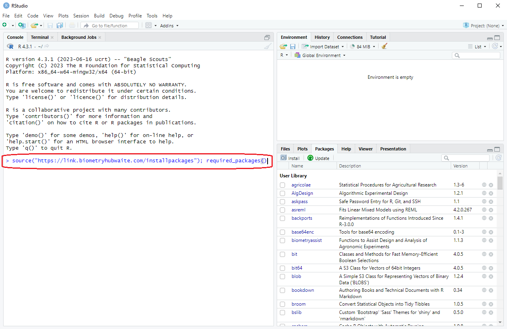
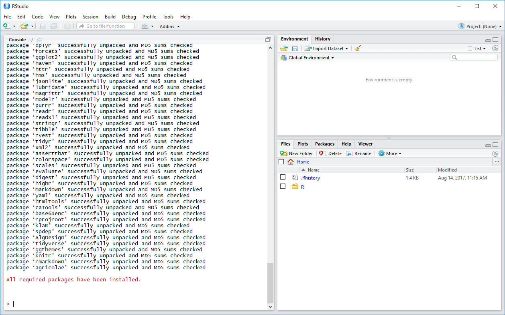

---

# Introduction  

**Welcome!**  

We are looking forward to meeting you, and teaching you about R!  

This document provides a brief introduction and a step-by-step guide on the installation of all software requirements for the course. These instructions will enable participants to have R, R-studio, and other packages operational before the first day of the course.  We will be using the R environment for statistical computing and graphics, so we need to install the following:  

- The language platform - [R](#R)
- An integrated development environment (IDE) - [RStudio](#RStudio), which serves as the front end, or interface, for R.
- The required additional extra packages

Installation of additional packages will be required for later courses (e.g. ASReml-R), but for the first course _Introduction to R_, R and RStudio are enough.

This guide assumes you are running a relatively recent version of Microsoft Windows (e.g. Windows 8/8.1/10) or Mac OS X/macOS (10.6+).  
  
R and RStudio are available for some of the most common Linux distributions (DEB and RPM packages available), and there is no problem using Linux for the courses, but unfortunately we can't provide installation instructions at this time. There are several guides available on the internet, so if you have problems we suggest this is a good starting point.

# Installation

## R {#R .tabset .tabset-fade}
R is a language and platform for statistics, computing and graphics, that is freely available. Among the functions in R are facilities to handle data, integrated tools for data analysis, graphics facilities for data analysis and a simple, well developed programming language. For more information please visit the R project homepage listed in [Further resources](#Further).  

### Windows
1. Click on [this link](https://cran.rstudio.com/bin/windows/base/release.htm) to download the most recent version of R onto your computer.
2. Run the downloaded file by opening the folder where you downloaded the file and double clicking on the filename (e.g. `r paste0("R-", params$rlatest, ".exe")`).
3. Follow the prompts in the installation. For our purposes, the installation defaults are satisfactory, so you can simply click on `Next` through the installation until it is complete. 

### Mac
1. Follow [this link](https://cran.rstudio.com/bin/macosx/) and download the most recent version of R for your version of macOS onto your computer.  
    i) macOS 10.11 (El Capitan) and higher: At the time of writing [R `r params$rlatest`](`r paste0("https://cran.r-project.org/bin/macosx/R-", params$rlatest, ".pkg")`) was the latest version.
    i) macOS 10.9 (Mavericks) and 10.10 (Yosemite): At the time of writing [R 3.3.3](https://cran.rstudio.com/bin/macosx/R-3.3.3.pkg) was the latest version.  
    ii) macOS 10.6 (Snow Leopard) - 10.8 (Mountain Lion): At the time of writing [R 3.2.1](https://cran.rstudio.com/bin/macosx/R-3.2.1-snowleopard.pkg) was the latest version.  
2. Run the downloaded file by opening the folder where you downloaded the file and double clicking on the filename (e.g. `r paste0("R-", eval(params$rlatest))`).
3. Follow the prompts in the installation. For our purposes, the installation defaults are satisfactory, so you can simply click on `Next` through the installation until it is complete.

## RStudio {#RStudio .tabset .tabset-fade}
RStudio is a powerful interactive development environment (IDE) for R which adds tools to make working with R easier. It is the recommended environment for all SAGI-STH Biometric Education Initiative (SSBEI) training courses. In this section we describe the setup of RStudio.   

### Windows  
1. Download the latest version from [this link](https://www.rstudio.com/products/rstudio/download/#download).
2. Run the downloaded file by opening the folder where you downloaded the file and double clicking on the filename. 
3. As with the R installation, the installation defaults are fine.

### Mac  
1. Download the latest version from [this link](http://rstudio.org/download/latest/stable/desktop/mac/RStudio-latest.dmg).
2. Run the downloaded file by opening the folder where you downloaded the file and double clicking on the filename. 
3. As with the R installation, the installation defaults are fine.

## Check {#Check .tabset .tabset-fade}
Check that R and RStudio have installed correctly by opening RStudio. By default, RStudio usually doesn't install an icon on your desktop, so search in the Start Menu (Windows) or Spotlight (Mac) for "RStudio". The icon you want looks something like this:    
You don't need to click on the R icon, or run the program R, as RStudio will do this automatically for you.   

### Windows
RStudio should start up and look something like this:  

### Mac
RStudio should start up and look something like this:  

## Packages
These will be discussed further in the workshop, however to maximise learning time, please follow the following steps to install these before the workshop. The steps are identical for Windows and Mac.  
  
Once RStudio is open (see [Check](#Check) above), just copy and paste the following command next to the `>` arrow in the console window on the left hand side of the session (see image below for placement), and then press enter.  

`source("http://bit.do/installr")`  
   
 

 
**Note:** This may take some time (5-10 minutes or more) depending on your internet speed and computer hardware. You will notice some red text appears in Rstudio, eventually followed by black text. This is normal and no cause for concern. You needn't read or record any of the text. Here is an image of what this step will look like:  
  
  
If this completes successfully, you will see "All required packages have been installed." in red text. If there is an error, it will provide some instructions.

The command you ran will be further explained in the workshop, but for now it is enough to know that it will install the packages which we will make use of in the courses.  

# Done!  
Congratulations! If you have made it this far, you are now set up and ready for the workshop.  

If you have experienced issues or errors and the software has not installed correctly, please [contact us early via email](mailto:biometrytraining@adelaide.edu.au). Alternatively, you can arrive 15 minutes early for the workshop to allow time to get the software installed and ready.

---

# Further resources {#Further}
The above will get your basic setup ready but here are some links if you are interested in reading a bit further.

- R project homepage: <https://www.r-project.org/>
- RStudio homepage: <https://www.rstudio.com/products/rstudio/>
- How to Use RStudio: <https://www.rstudio.com/ide/docs/>
- R Installation and Administration: <https://cran.r-project.org/doc/manuals/R-admin.html>
- R FAQ: <https://cran.r-project.org/doc/FAQ/R-FAQ.html>
- More about add-on packages in the R Installation and Administration Manual:  <https://cran.r-project.org/doc/manuals/R-admin.html#Add_002don-packages>

